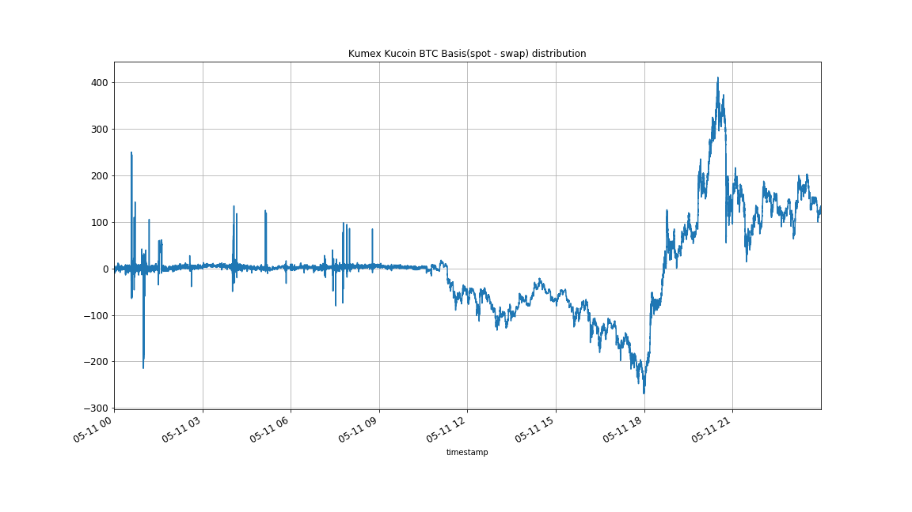

# market-analysis-spot-swap
Analysis of kucoin spot and kumex swap 

# analysis
* Day: 2020-05-11
---
## Kumex swap and Kucoin spot BTC Basis(spot - swap) distribution

---
## Analysis
-|BTCUSDT|XBTUSDM|kumex-XBTUSDM-BTCUSDT_arb
---|---|---|---
mean | 8693.086885841822 | 8689.208861137064 | 3.8780247031408197
std | 132.50621785698777 | 100.54430499099688 | 85.08222414691566
min | 8257.05 | 8253.5 | -269.4500000000007
25% | 8615.900000000001 | 8682.5 | -2.9500000000007276
50% | 8706.349999999999 | 8749.5 | 2.0499999999992724
75% | 8755.150000000001 | 8749.5 | 5.349999999998545
max | 9160.45 | 8836.5 | 410.9500000000007

ps: 
`mean`: 均值
`std`: 标准差
`25%`: 分位数
`50%`: 中位数
`25%`: 分位数
`max`: 最大值